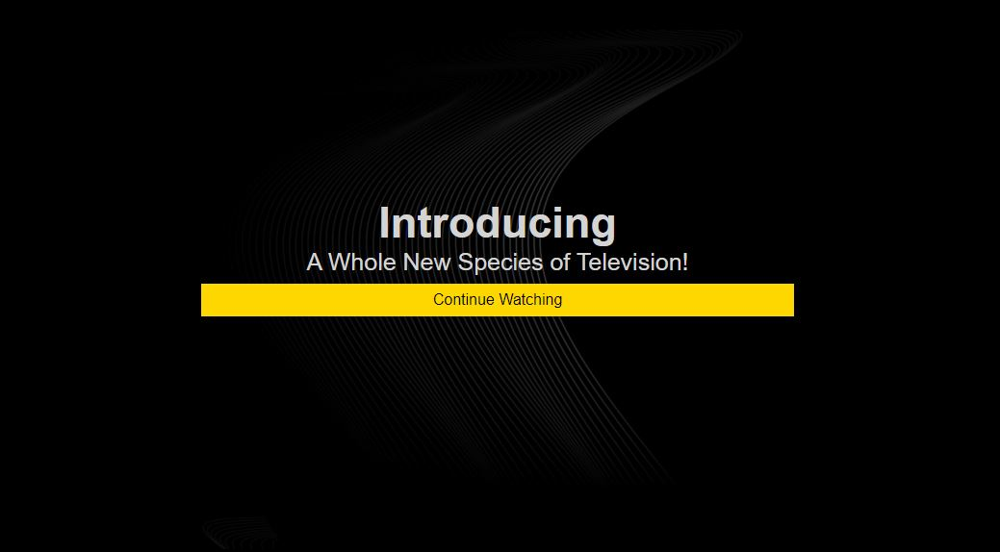
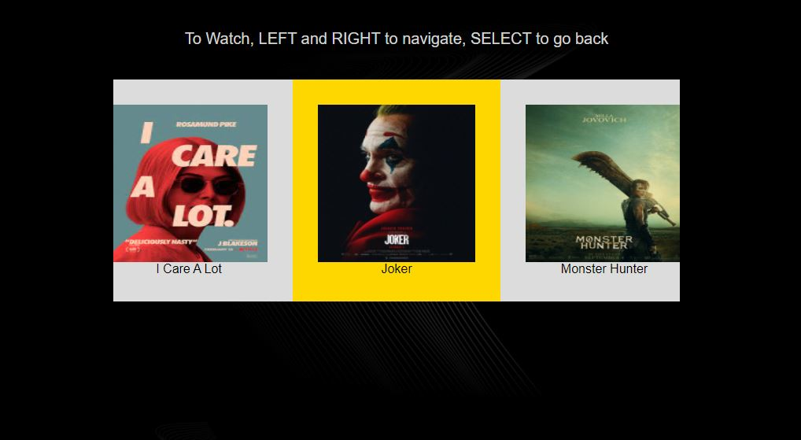

# TAL Application





# Getting Started

```
git clone https://github.com/rashmiranjanbuffer0/carousel.git
cd talexample
npm install
npm start
```

Visit http://localhost:1337 in your browser. Use the UP, DOWN, LEFT, RIGHT keys to navigate, use ENTER/RETURN to select.

# More Information

See [github.com/bbc/tal](https://www.github.com/bbc/tal) or [bbc.github.io/tal](http://bbc.github.io/tal/getting-started/introducing-tal.html) for documentation.
